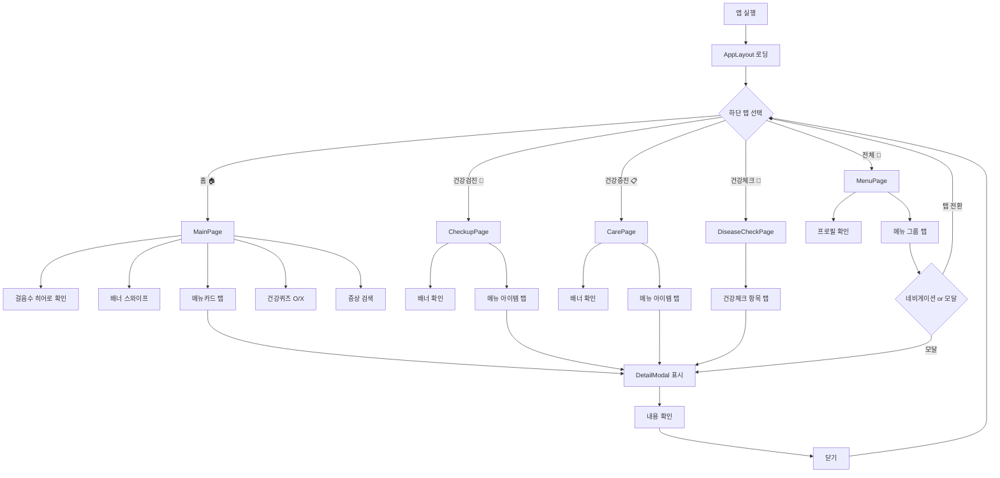
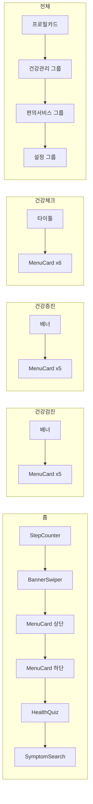

# 사용자 흐름도 — 어떠케어 Flutter 앱

> 작성 세션: 세션 0 | 작성일: 2026-03-19

---

## 앱 메인 흐름

```mermaid
flowchart TD
    A[앱 실행] --> B[AppLayout 로딩]
    B --> C{하단 탭 선택}

    C -->|홈 🏠| D[MainPage]
    C -->|건강검진 💚| E[CheckupPage]
    C -->|건강증진 📋| F[CarePage]
    C -->|건강체크 🧩| G[DiseaseCheckPage]
    C -->|전체 💬| H[MenuPage]

    D --> D1[걸음수 히어로 확인]
    D --> D2[배너 스와이프]
    D --> D3[메뉴카드 탭]
    D --> D4[건강퀴즈 O/X]
    D --> D5[증상 검색]

    D3 --> M[DetailModal 표시]

    E --> E1[배너 확인]
    E --> E2[메뉴 아이템 탭]
    E2 --> M

    F --> F1[배너 확인]
    F --> F2[메뉴 아이템 탭]
    F2 --> M

    G --> G1[건강체크 항목 탭]
    G1 --> M

    H --> H1[프로필 확인]
    H --> H2[메뉴 그룹 탭]
    H2 --> H3{네비게이션 or 모달}
    H3 -->|탭 전환| C
    H3 -->|모달| M

    M --> M1[내용 확인]
    M1 --> M2[닫기]
    M2 --> C
```

## 탭별 사용자 경험

```mermaid
flowchart LR
    subgraph 홈
        direction TB
        S[StepCounter] --> BN[BannerSwiper]
        BN --> MC1[MenuCard 상단]
        MC1 --> MC2[MenuCard 하단]
        MC2 --> HQ[HealthQuiz]
        HQ --> SS[SymptomSearch]
    end

    subgraph 건강검진
        direction TB
        CB[배너] --> CI[MenuCard x5]
    end

    subgraph 건강증진
        direction TB
        CAB[배너] --> CAI[MenuCard x5]
    end

    subgraph 건강체크
        direction TB
        DT[타이틀] --> DI[MenuCard x6]
    end

    subgraph 전체
        direction TB
        MP[프로필카드] --> MG1[건강관리 그룹]
        MG1 --> MG2[편의서비스 그룹]
        MG2 --> MG3[설정 그룹]
    end
```
