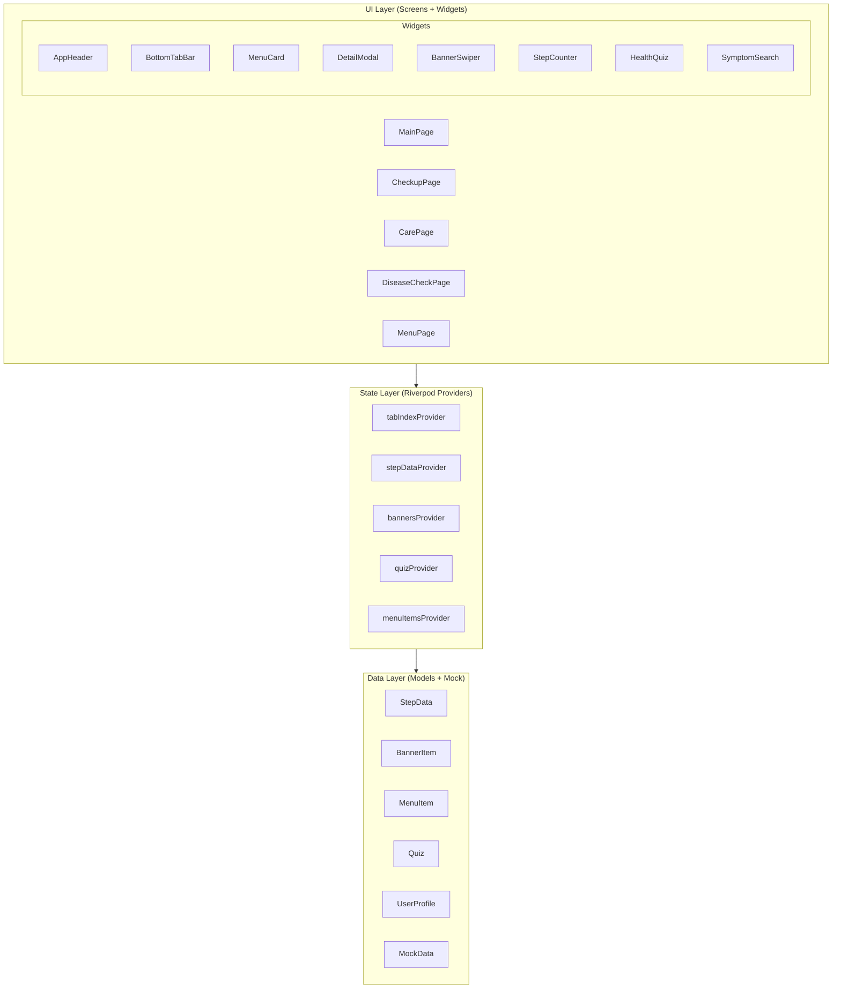
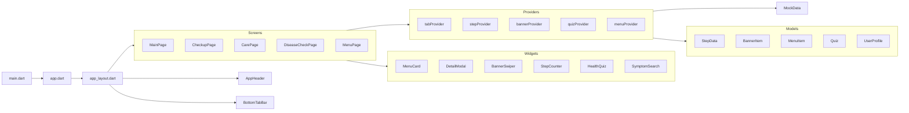
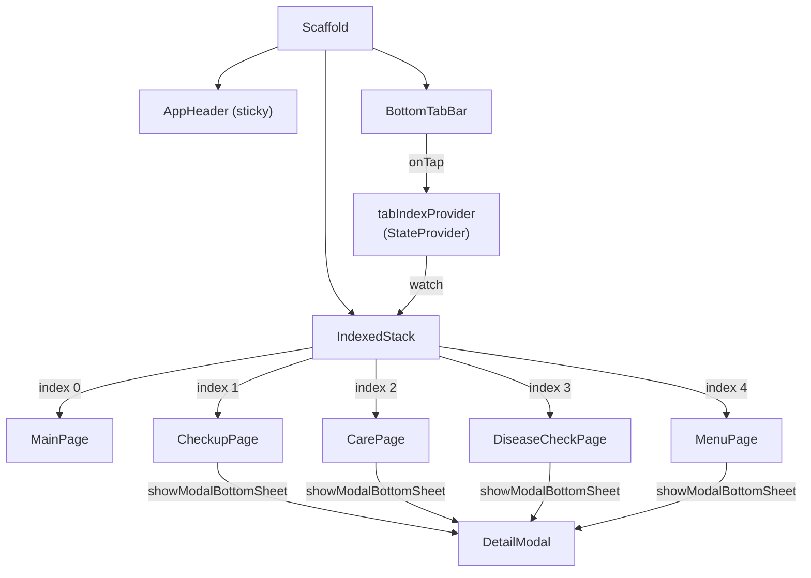

# 아키텍처 다이어그램 — 어떠케어 Flutter 앱

> 작성 세션: 세션 0 | 작성일: 2026-03-19

---

## 레이어 구조

```mermaid
graph TB
    subgraph UI["UI Layer (Screens + Widgets)"]
        direction LR
        MP[MainPage]
        CP[CheckupPage]
        CAP[CarePage]
        DCP[DiseaseCheckPage]
        MNP[MenuPage]

        subgraph Widgets
            AH[AppHeader]
            BTB[BottomTabBar]
            MC[MenuCard]
            DM[DetailModal]
            BS[BannerSwiper]
            SC[StepCounter]
            HQ[HealthQuiz]
            SS[SymptomSearch]
        end
    end

    subgraph State["State Layer (Riverpod Providers)"]
        direction LR
        TP[tabIndexProvider]
        SP[stepDataProvider]
        BP[bannersProvider]
        QP[quizProvider]
        MIP[menuItemsProvider]
    end

    subgraph Data["Data Layer (Models + Mock)"]
        direction LR
        SD[StepData]
        BI[BannerItem]
        MI[MenuItem]
        QZ[Quiz]
        UP[UserProfile]
        MD[MockData]
    end

    UI --> State
    State --> Data
```

## 모듈 의존성

```mermaid
graph LR
    main.dart --> app.dart
    app.dart --> app_layout.dart
    app_layout.dart --> AppHeader
    app_layout.dart --> BottomTabBar
    app_layout.dart --> Screens

    subgraph Screens
        MainPage
        CheckupPage
        CarePage
        DiseaseCheckPage
        MenuPage
    end

    Screens --> Widgets
    Screens --> Providers

    subgraph Widgets
        MenuCard
        DetailModal
        BannerSwiper
        StepCounter
        HealthQuiz
        SymptomSearch
    end

    subgraph Providers
        tabProvider
        stepProvider
        bannerProvider
        quizProvider
        menuProvider
    end

    Providers --> MockData
    Providers --> Models

    subgraph Models
        StepData
        BannerItem
        MenuItem
        Quiz
        UserProfile
    end
```

## 네비게이션 구조

```mermaid
graph TB
    Scaffold --> AppBar["AppHeader (sticky)"]
    Scaffold --> Body["IndexedStack"]
    Scaffold --> Nav["BottomTabBar"]

    Body -->|index 0| Tab0[MainPage]
    Body -->|index 1| Tab1[CheckupPage]
    Body -->|index 2| Tab2[CarePage]
    Body -->|index 3| Tab3[DiseaseCheckPage]
    Body -->|index 4| Tab4[MenuPage]

    Nav -->|onTap| TP["tabIndexProvider\n(StateProvider<int>)"]
    TP -->|watch| Body

    Tab1 -->|showModalBottomSheet| Modal[DetailModal]
    Tab2 -->|showModalBottomSheet| Modal
    Tab3 -->|showModalBottomSheet| Modal
    Tab4 -->|showModalBottomSheet| Modal
```
