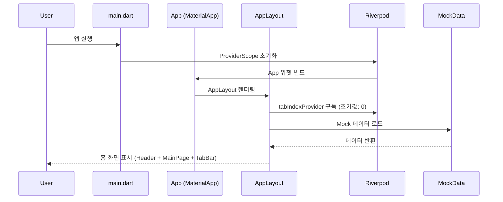
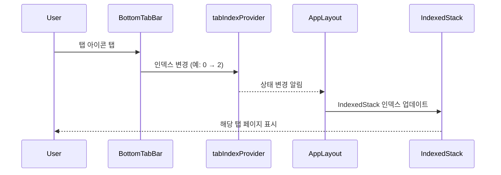
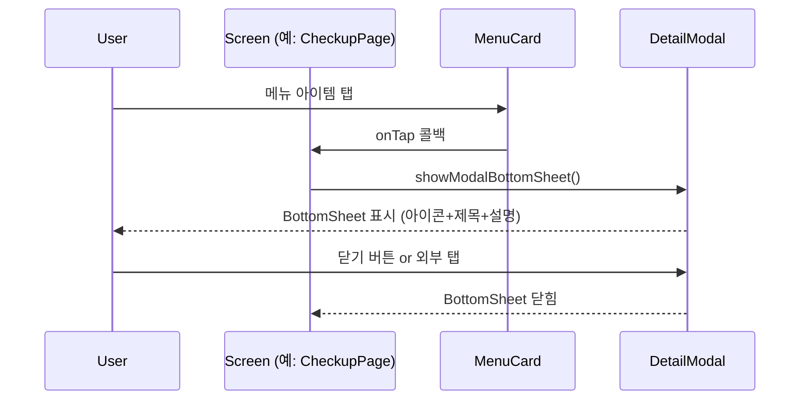
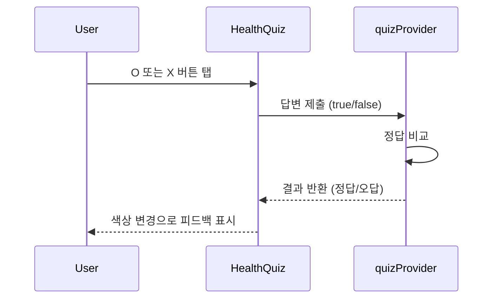

# 시퀀스 다이어그램 — flutter-ui-migration

> 작성 세션: 세션 0 | 작성일: 2026-03-19

---

## 앱 초기화 시퀀스

```mermaid
sequenceDiagram
    participant User
    participant Main as main.dart
    participant App as App (MaterialApp)
    participant Layout as AppLayout
    participant Provider as Riverpod
    participant Mock as MockData

    User->>Main: 앱 실행
    Main->>Provider: ProviderScope 초기화
    Provider->>App: App 위젯 빌드
    App->>Layout: AppLayout 렌더링
    Layout->>Provider: tabIndexProvider 구독 (초기값: 0)
    Layout->>Mock: Mock 데이터 로드
    Mock-->>Layout: 데이터 반환
    Layout-->>User: 홈 화면 표시 (Header + MainPage + TabBar)
```

## 탭 전환 시퀀스

```mermaid
sequenceDiagram
    participant User
    participant TabBar as BottomTabBar
    participant Provider as tabIndexProvider
    participant Layout as AppLayout
    participant Stack as IndexedStack

    User->>TabBar: 탭 아이콘 탭
    TabBar->>Provider: 인덱스 변경 (예: 0 → 2)
    Provider-->>Layout: 상태 변경 알림
    Layout->>Stack: IndexedStack 인덱스 업데이트
    Stack-->>User: 해당 탭 페이지 표시
```

## 메뉴 아이템 탭 → DetailModal 시퀀스

```mermaid
sequenceDiagram
    participant User
    participant Page as Screen (예: CheckupPage)
    participant Card as MenuCard
    participant Modal as DetailModal

    User->>Card: 메뉴 아이템 탭
    Card->>Page: onTap 콜백
    Page->>Modal: showModalBottomSheet()
    Modal-->>User: BottomSheet 표시 (아이콘+제목+설명)
    User->>Modal: 닫기 버튼 or 외부 탭
    Modal-->>Page: BottomSheet 닫힘
```

## 건강퀴즈 O/X 시퀀스

```mermaid
sequenceDiagram
    participant User
    participant Quiz as HealthQuiz
    participant Provider as quizProvider

    User->>Quiz: O 또는 X 버튼 탭
    Quiz->>Provider: 답변 제출 (true/false)
    Provider->>Provider: 정답 비교
    Provider-->>Quiz: 결과 반환 (정답/오답)
    Quiz-->>User: 색상 변경으로 피드백 표시
```
